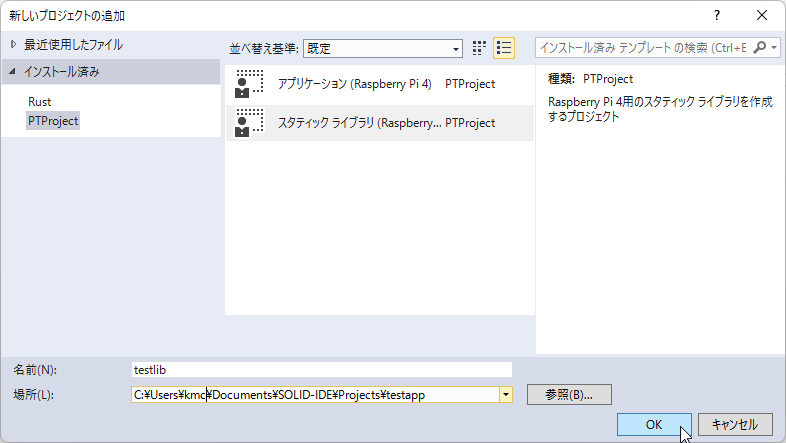
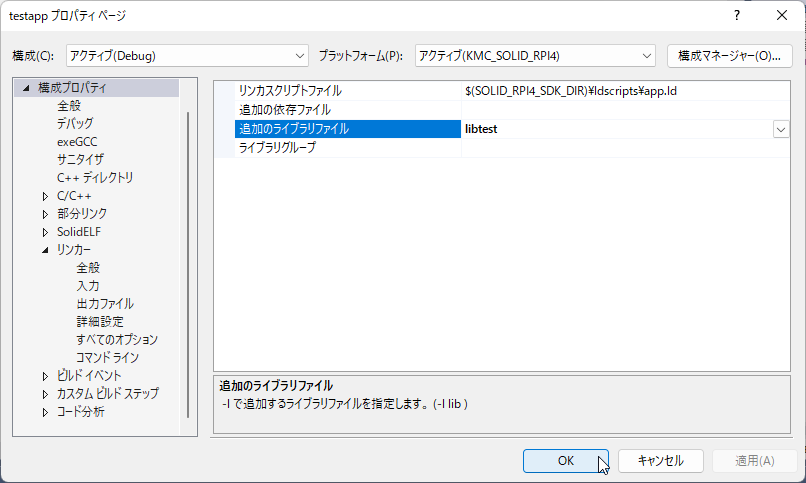
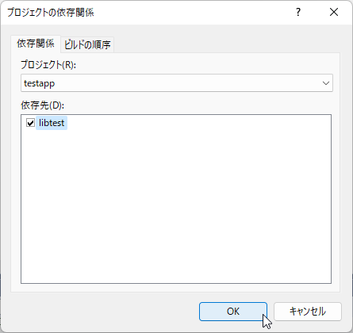

## スタティックライブラリの追加

[新規プロジェクトの作成](build-and-run-newproject.md) で作成した `testapp` に、スタティックライブラリを追加します。

### ライブラリの新規作成
メニューの **ファイル - 追加 - 新しいプロジェクト** を選択して **新しいプロジェクトの追加** ウィンドウを開きます。
**PTProject** の **スタティックライブラリ (Raspberry Pi 4)** を選択し、ライブラリ名などを設定後、 **OK** を押下してください。

> Rustのライブラリを作成する場合は、**Rust Library (Raspberry Pi 4)** を選択してください。

 

これで、空のソースファイル `lib.cpp` を持ったスタティックライブラリのプロジェクトが生成されます。

### ライブラリの追加

ソリューションエクスプローラのアプリケーションプロジェクトを右クリックし、**プロパティ** を開きます。
**構成プロパティ - リンカー - 入力** にある **追加のライブラリファイル** 作成したライブラリを追加します。

 

### ビルド依存関係の設定

アプリケーションより先にライブラリがビルドされる事を保証するために、ビルド依存関係を設定します。

ソリューションエクスプローラのアプリケーションプロジェクトを右クリックし、**ビルド依存関係 - プロジェクト依存関係** を開いて
追加したライブラリ名にチェックを入れてください。

 
