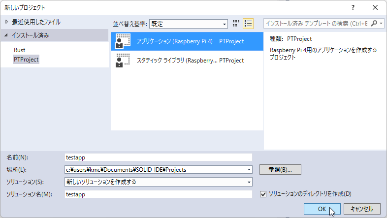
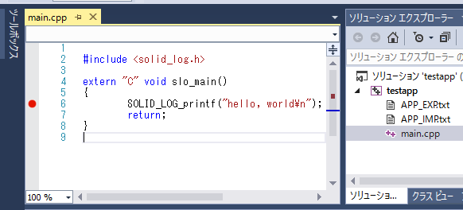

## 新規プロジェクトの作成

### プロジェクトの作成

メニューの **ファイル - 新規作成 - プロジェクト** を選択すると、**新しいプロジェクト** ウィンドウが開きます。
プロジェクト名を設定し、PTProject内の **アプリケーション (Raspberry Pi 4)** を選択して **OK** ボタンを押下してください。

 

プロジェクトが作成され、エントリポイントである `slo_main` 関数が記述されたソースファイル `main.cpp` が自動生成されます。

 

このプログラムをビルドして実行すると、シリアルコンソールに **hello, world** が表示されます。
