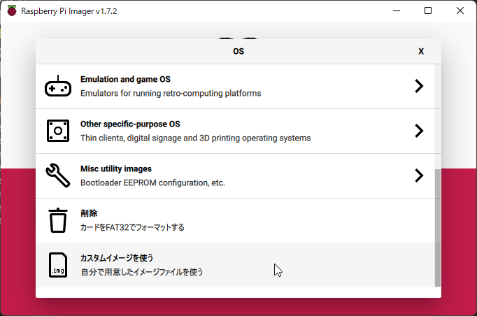
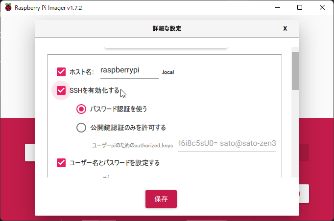

# SDカードの準備

最新の[SOLID for Raspberry Pi 4用SDカードイメージ](http://solid.kmckk.com/rpi4/image_2022-07-05-SOLID-RPI4-raspios-bullseye-lite.img.xz)をダウンロードし、[Raspberry Pi Imager](https://www.raspberrypi.com/software/)で書き込みます。

## カスタムイメージの選択

Raspberry Pi Imagerを起動し、OSの選択画面で **カスタムイメージを使う** を選択し、ダウンロードしたSDカードイメージ (`image_yyyy-mm-dd-SOLID-RPI4-raspios-bullseye-lite.img.xz`) を指定します。

 

## 設定

ウィンドウ右下の設定ボタンをクリックするか <kbd>Ctrl+Shift+X</kbd> を押し、 **詳細な設定** を開き、以下の項目を設定してください。

- **SSHを有効化する**: SOLID-IDEからネットワーク経由でアプリケーションをロード・デバッグするためにSSHプロトコルを使用します。
- (省略可能、推奨) **ユーザ名とパスワードを設定する**: ここで指定することで、Raspberry Pi 4の初回ブート時の入力 (キーボードとモニタの接続が必要) を省略できます。
- (省略可能) **Wi-Fiを設定する**: Wi-Fi経由でネットワーク接続したい場合、ここで設定できます。有線接続の場合は必要ありません。

 

> **注意:** エクスプローラからイメージを選択しRasberry Pi Imagerを起動した場合、設定ボタンが表示されません ([raspberrypi/rpi-imager#451](https://github.com/raspberrypi/rpi-imager/issues/451))。

## イメージの書き込み

**書き込む** ボタンをクリックしてイメージを書き込んでください。

## 起動

書き込んだSDカードをRaspberry Pi 4のSDカードスロットに挿入し、必要に応じてモニタやキーボードなどを接続し、電源を接続してください。初回起動時は初期設定のために2回ほど自動的に再起動が行われます。

Imagerで初期パスワードを設定していれば、ログインプロンプトがUARTコンソールと (接続されていれば) モニタに表示されます。

```
Debian GNU/Linux 11 krpi tty1

raspberrypi login: _
```

> Lite版OSイメージを使用しているため、GUIはインストールされません。

