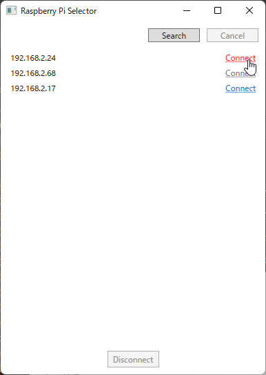

## ライセンスの有効化

### SSH鍵ペアの作成

ホストPCで以下のコマンドを実行し、SSH鍵ペア (公開鍵と秘密鍵) を生成します。

```
> ssh-keygen -t rsa

Enter file in which to save the key (C:\Users\<Username>/.ssh/id_rsa): # Enter
Enter passphrase (empty for no passphrase): # Enter
Enter same passphrase again: # Enter
```

> **注意:** 鍵ペアが既に存在する場合、 `Overwrite (y/n)?` という確認メッセージが表示されます。この場合は新たに鍵ペアを生成する必要はありません。 `n` を入力して中止してください。 **鍵ペアを上書きしてしまった場合、元に戻す方法はありません。**

### SSH公開鍵の転送と書き込み

生成した `id_rsa.pub` をSCPなどのプログラムを使用して Raspberry Pi 4 側に転送してください。

```
> scp id_rsa.pub user@hostname:
```

Raspberry Pi 4 側で `authorized_keys` に書き込みます。

```
$ mkdir .ssh
$ chmod 700 .ssh
$ cat id_rsa.pub >> .ssh/authorized_keys
$ chmod 600 .ssh/authorized_keys
$ rm id_rsa.pub
```
### `Raspberry Pi Selector`の起動とライセンスの取得

ソリューションを開くと、`Raspberry Pi Selector` が自動で起動します。
`Search` ボタンを押すとネットワーク内に存在する Raspberry Pi 4 の IPアドレスリストが
表示されるので、SSH公開鍵を書き込んだターゲットを選択して、`Connect` を押してください。

   
