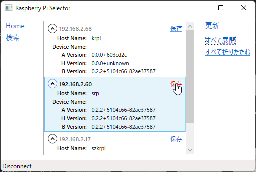
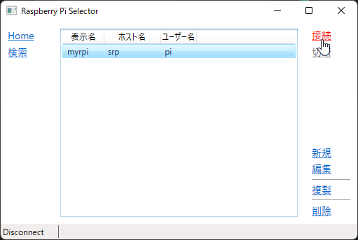

# ライセンスの有効化

## SSH鍵ペアの作成

ホストPCで以下のコマンドを実行し、SSH鍵ペア (公開鍵と秘密鍵) を生成します。

```
> ssh-keygen -t ed25519

Enter file in which to save the key (C:\Users\<Username>/.ssh/id_ed25519): # Enter
Enter passphrase (empty for no passphrase): # Enter
Enter same passphrase again: # Enter
```

> **注意:** 鍵ペアが既に存在する場合、 `Overwrite (y/n)?` という確認メッセージが表示されます。この場合は新たに鍵ペアを生成する必要はありません。 `n` を入力して中止してください。 **鍵ペアを上書きしてしまった場合、元に戻す方法はありません。**

## SSH公開鍵の転送と書き込み

生成した `id_ed25519.pub` を[SCP](system-linux.md#secure-copy)などのプログラムを使用してRaspberry Pi 4側に転送してください。

```
> scp id_ed25519.pub pi@raspberrypi:
```

> `pi` と `raspberrypi` はそれぞれ[イメージ書き込み時](./flashing-sd-card.md)にRaspberry Pi Imagerで指定したユーザー名とホスト名で置き換えてください。これがデフォルト値なので、指定していなければ置き換える必要はありません。

> `Could not resolve hostname` と表示されて接続できない場合、トラブルシューティング "[Raspberry Piに接続できない。ホスト名を指定して接続している。](troubleshooting.md#ネットワーク)" を参照してください。

Raspberry Pi 4に[SSH](system-linux.md#sshリモートログイン)でリモートログインし、転送した `id_ed25519.pub` を `authorized_keys` ファイルに追加してください。

```
> ssh pi@raspberrypi

$ mkdir .ssh
$ chmod 700 .ssh
$ cat id_ed25519.pub >> .ssh/authorized_keys
$ chmod 600 .ssh/authorized_keys
$ rm id_ed25519.pub
```

> Raspberry Pi Selectorは非対話的な認証方法のみをサポートしているため、公開鍵認証の設定が必要です。

## Raspberry Pi Selectorの起動とライセンスの取得

ソリューションを開くと、Raspberry Pi Selectorが自動で起動します。
**検索** を押すとネットワーク内に存在するRaspberry Pi 4のリストが表示されるので、IPアドレスやホスト名などを確認し、SSH公開鍵を書き込んだターゲットを選択して **保存** を押してください。

> 手動で起動するにはSOLID-IDEのメニューから **ヘルプ - ライセンス ツール - ラスベリーパイ ライセンスツールを起動** を選択してください。

   

任意のプロファイル名を **表示名** に、接続先（[SSH](system-linux.md#sshリモートログイン)の接続に使用したもの）を **ホスト名** に、ログイン時のユーザ名を **ユーザー名** にそれぞれ入力し、 **保存**を押します。

   

**Home** 画面から保存したプロファイルを選択して、 **接続** を押してください。

   
