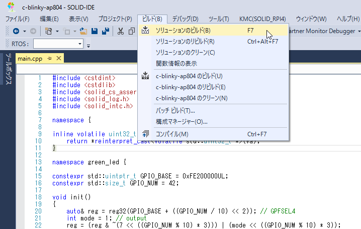
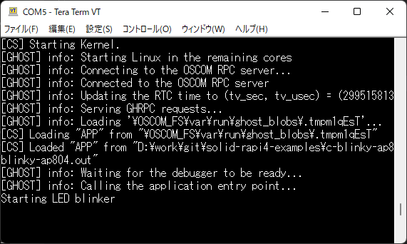
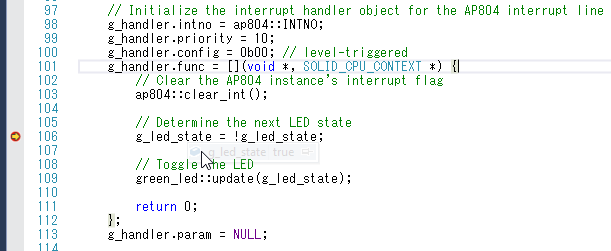

## 既存プロジェクトの実行

ここでは、[c-blinky-ap804](https://github.com/KyotoMicrocomputer/solid-rapi4-examples/tree/main/c-blinky-ap804) を例に、ビルドから実行までを説明します。

> **注意:** [ライセンスの有効化](doc/../license.md)が正常に完了していない場合、ビルドやデバッグの実行に失敗します。

### c-blinky-ap804 のビルド

SOLID-IDE で `c-blinky-ap804.ptsln` を開き、メニューの **ビルド - ソリューションのビルド (F7)** を実行します。

 

### c-blinky-ap804 の実行とデバッグ

メニューの **デバッグ - デバッグ開始 (F5)** を実行すると、ビルドしたプログラムがロードされ実行状態になり、
シリアルコンソールに **Starting LED Blinker** が出力されます。

 

割り込みハンドラとして `g_handler.func` に登録された処理にブレークポイント設定すると、実行を停止させる事が出来ます。
停止後は、変数の参照や、ステップ実行などが可能です。

 
