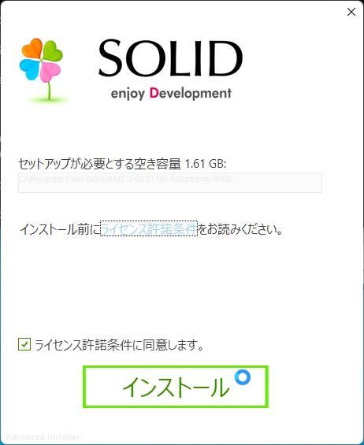

## 開発環境のセットアップ

### インストーラのダウンロード

インストーラ (`SOLID-RPI4B-<version>.exe`) を下記のサイトからダウンロードしてください。

### インストール

1. ダウンロードしたファイルを実行し、`ライセンス使用許諾に同意します。` にチェックを入れて「インストール」ボタンを押下します。

    

2. Visual Studio 2013 Shell (Isolated) のインストールが開始されます。

    詳細は [Visual Studio 2013 Shell (Isolated) のインストール](http://solid.kmckk.com/doc/skit/current/tutorial/installation.html#shell) を参照してください。

3. 次にデバッガ、IDEのコンポーネント、ツールチェーンなどがインストールされますので、ダイアログの指示に従ってインストールしてください。

4. `SOLID for Raspberry Pi4` のインストールが完了したら、`Visual Studio Shell 2013 Update 5 ` をインストールしてください。

    詳細は [Visual Studio 2013 のアップデート](http://solid.kmckk.com/doc/skit/current/tutorial/installation.html#visual-studio-2013) を参照してください。
