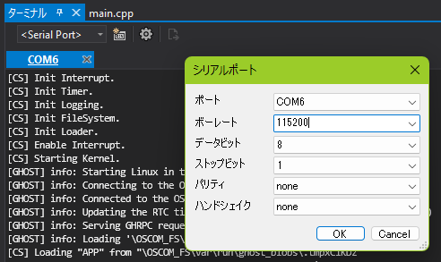

# SOLID-OSシステム

SOLID for Raspberry Pi 4で使用するSOLID-OSシステムについて説明します。

## SOLID-OS

[SOLID-OS][2]はSOLID for Raspberry Pi 4が使用するRTOSアプリケーション実行環境です。

マルチコア対応の[TOPPERS/FMP3][1] RTOSカーネルの[独自拡張][4]版を使用しており、以下の機能に対応しています。

- **動的資源生成:** カーネル資源を `acre_tsk` 等のカーネル関数を使用して生成できます。
- **優先度拡張:** タスク優先度の有効範囲は `[1, 256]` です。
- **優先度継承ミューテックス:** `TA_INHERIT` 属性をサポートしています。
- **Readers-Writerロック**
- **[イベントトラッカー][11]:** タスクや割込みハンドラの実行履歴を記録しIDE上で可視化できます。

SOLID-OSが提供するファイルシステム、割込み処理、ネットワーク等のAPIはユーザアプリケーションから使用することができます。

## Ghost

**Ghostアプリケーションホスト**はSOLID-OS側のメインアプリケーションで、[Ghostd](system-linux.md#Ghostd)と連携し、ユーザアプリケーションを動的ロードし起動する役目があります。

## OS間通信 (OSCOM RPC)

**OSCOM RPC**はファイルやBSDソケット等のシステムコールを仲介し[Linux](system-linux.md)側で処理するためのOS間通信機構です。これによりSOLID APIを経由して透過的にLinuxファイルシステムやネットワークにアクセスできます。

SOLID[ファイルシステムAPI][10]ではマウントポイント `\OSCOM_FS` がLinuxファイルシステムにマップされています。例えばデバイスファイル `/dev/urandom` はアプリケーションコードからは `\OSCOM_FS\dev\urandom` というパス名でアクセスできます。

> **注意:** パス区切り文字は[Windows][12]と同様にバックスラッシュ (ASCII 92, U+005C, `\`, `"\\"`) が標準です。

[制限事項#OS間通信 (OSCOM RPC)](limitations.md#os間通信-oscom-rpc) も参照してください。

## 割込み処理

GIC-400割込みコントローラをLinuxと共用しています。割込みハンドラはSOLID[割込みコントローラAPI][5]を使用して登録できます。

このシステムではRTOSカーネルで扱うものとして静的に[定義][6]された割込みラインは存在しないため `acre_isr` などの関数は機能しません。

## ログ出力

SOLID[ログ出力API][3] (e.g., `SOLID_LOG_printf`) はBCM2711 Mini UART (GPIO 14/15) に接続されています。ボーレートは115200に設定されています。

> **注意:** [Linuxシリアルコンソール](system-linux.md#UARTシリアルコンソール)も同じUARTポートを使用するため、同時に出力が行われると出力内容が壊れることがあります。

ログ出力を見るためにはUSB-UARTケーブル等が必要です。Windows向けのシリアル端末プログラムとしてはTera TermやPuTTYなどが定番です。SOLID-IDEの[内蔵ターミナル][13]もシリアルポートに対応しています。

<!-- TODO: 別のUARTポートに接続すればRaspberry Pi OS経由で出力が見れるのでは? -->

## BSPデバイスドライバ

SOLID-OSのボード依存コードは以下の通り実装されています。

- [DMAコントローラAPI][8]はサポートされていません。
- [RTC API][7]はLinuxのシステム時刻を返します。
- [ログ出力API][3]は[上記](#ログ出力)の通りBCM2711 Mini UARTに出力します。
- [タイマ][9]はVirtual Timer (`CNTVCT_EL0`) を利用して実装されています。
- 乱数生成APIはLinuxの `/dev/random` からエントロピーを取得します。非タスクコンテクストでは `SOLID_ERR_NOTSUPPORTED` エラーを返します。
- ファイルシステムスレッド安全性ラッパーはカーネルミューテックスを排他制御に使用します。非タスクコンテクストでは `E_CTX` エラーを返します。

## メモリマップ

ローダブルアプリケーション起動時のメモリマップ (抜粋) は以下の通りです。

|        仮想アドレス (VA)         | 物理アドレス (PA) |              説明             |
|----------------------------------|-------------------|-------------------------------|
| `[0x0_0000_0000, 0x0_0007_ffff]` | 無効              | Nullアクセスを捕捉する        |
| `[0x0_fc00_0000, 0x0_ff7f_ffff]` | VAと同じ          | BCM2711 main peripherals      |
| `[0x0_ff80_0000, 0x0_ff80_0fff]` | VAと同じ          | BCM2711 ARM Local peripherals |
| `[0x2_e000_0000, 0x2_ffff_0000]` | (RAMから割当て)   | SOLID-OS、ヒープ、スタック等  |
| `[0x3_0000_0000, 0x3_ffff_ffff]` | (RAMから割当て)   | ローダブルアプリケーション    |

SOLID-OSで使用するRAMの物理アドレス範囲はdevice tree overlay `/boot/overlays/ghost-rpi4.dtbo` によってLinuxの割当てから除外しています。

> **注意:** メモリマップはアプリケーションから変更できますが、既存のマッピングを解除したり、新たなPA範囲をマッピングしてアクセスするのは一般に安全ではなく、データ破壊やシステムのハングアップに繋がることがあります。例えばLinuxがファイルキャッシュとして使用しているRAM領域のデータを変更した場合、ファイルの内容が破壊される可能性があります。

[1]: https://toppers.jp/fmp3-kernel.html
[2]: http://solid.kmckk.com/doc/skit/current/os/index.html
[3]: http://solid.kmckk.com/doc/skit/current/os/cs/log.html
[4]: http://solid.kmckk.com/doc/skit/current/os/kernel/api_spec.html
[5]: http://solid.kmckk.com/doc/skit/current/os/cs/intc.html
[6]: http://solid.kmckk.com/doc/skit/current/os/kernel/kernel_config.html#id63
[7]: http://solid.kmckk.com/doc/skit/current/os/cs/rtc.html
[8]: http://solid.kmckk.com/doc/skit/current/os/cs/dmac.html
[9]: http://solid.kmckk.com/doc/skit/current/os/cs/timer.html
[10]: http://solid.kmckk.com/doc/skit/current/os/filesystem.html
[11]: http://solid.kmckk.com/doc/skit/current/user_guide/event_tracker.html
[12]: https://docs.microsoft.com/en-us/windows/win32/fileio/naming-a-file?redirectedfrom=MSDN#naming-conventions
[13]: http://solid.kmckk.com/doc/skit/current/user_guide/terminal.html

