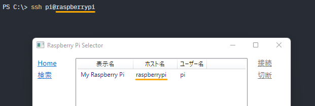

# トラブルシューティング

本ドキュメントではSOLID for Raspberry Pi 4を使用中に起こる可能性のある問題と解決策を示します。

## ハードウェア

<details>
<summary><b>手元にあるRaspberry Pi 4 Model Bのメモリサイズが分からない。</b></summary>

Raspberry Pi 4上で `/proc/cpuinfo` から[モデルリビジョンコード][4]を取得して判別できます。2022年の時点では以下の規則に従っているようです。

| リビジョンコード | モデル | メモリサイズ |
| ---------------- | ------ | ------------ |
| `a0311*`         | 4B     | 1GB          |
| `b0311*`         | 4B     | 2GB          |
| `c0311*`         | 4B     | 4GB          |
| `d0311*`         | 4B     | 8GB          |

例えば、以下の例ではRaspberry Pi 4 Model B 8GBモデルであると分かります。

```
$ cat /proc/cpuinfo | grep Revision
Revision        : d03114
```

</details>

## ネットワーク

<details>
<summary><b>Raspberry Piに接続できなくなった。</b></summary>

Linuxカーネルがハングアップしている可能性が疑われます。UARTコンソールでエンターキーを入力し、Linuxのログインプロンプトが表示されるか確認してください。UARTコンソールも反応しない場合、Raspberry Piの電源を切断して再起動することが必要です。

SOLID-OSとLinuxは完全に分離されていないため、モニタデバッガやロードしたアプリケーションの誤作動が原因でLinuxがハングアップする可能性があります。例えば、Linuxが使用しているペリフェラルの割込みラインの設定をSOLID-OSから変更することは推奨されません。

</details>

<details>
<summary><b>インターネットの接続の調子が悪くなった。</b></summary>

Raspberry Piがハングアップしていないか確認してください。Linuxカーネルがハングアップするとハードウェアが大量の[Pauseフレーム][2]を送信し、一部のネットワーク機器の動作に一時的な支障を来す場合があることを確認しています。

</details>

<details>
<summary><b>Raspberry Piのファイアウォールを有効化したらRaspberry Pi Selectorに表示されなくなった。</b></summary>

Raspberry PiがUDPポート51590のパケットが受信できるように設定してください。

</details>

<details>
<summary><b>Raspberry Pi Selectorで接続時に "Host key verification failed" というエラーが出る。</b></summary>

SSHサーバーは固有の識別子を持っており、SSHクライアントはこれとホスト名の対応関係を `%USERPROFILE%\.ssh\known_hosts` テキストファイルで記憶しています。Raspberry Pi Selectorはここに記憶された既知のサーバーにのみ接続できます。既知のサーバーでも、記憶されているのと全く同じホスト名で接続しなければなりません。

対応関係を記憶させるには、一度Windows標準のSSHクライアントを使用して[サーバーに接続](system-linux.md#sshリモートログイン)してください。この際、**ホスト名がRaspberry Pi Selectorに登録されているものと完全に同じ**になるようにしてください。

> **注意:** WSL (Windows Subsystem for Linux) やMSYS2からこれを行うと異なる場所の `known_hosts` に保存される可能性があります。[Windowsオプション機能][9]として提供されているOpenSSHクライアントを使用するようにしてください。

<p align="center"></p>

</details>

## ビルド

<details>
<summary><b>ビルドが "Failed to get license: SOLID_RASPI" エラーで失敗する。</b></summary>

Raspberry Pi Selectorが起動していて、[ターゲットに接続](license.md#raspberry-pi-selectorの起動とライセンスの取得)した状態であることを確認してください。

</details>

<details>
<summary><b>Rustプロジェクトのビルドが "No such file or directory" エラーで失敗する。</b></summary>

Rust MinGWツールチェーンの[制約][3]です。ソリューションを非ASCII文字を含まない短いパスの場所に移動して再度お試しください。ソリューションの完全パスが110文字以内に収まるようにすることを推奨します。

</details>

<details>
<summary><b>Rustプロジェクトのビルドが "the 'cargo.exe' binary, normally provided by the 'cargo' component, is not applicable to the 'nightly-2022-08-12-x86_64-pc-windows-gnu' toolchain" エラーで失敗する。</b></summary>

ツールチェーンのインストールに失敗している可能性があります。SOLID-IDEを終了後、コマンドプロンプトで以下のコマンドを実行し、ツールチェーンの再インストールを行ってから、再度お試しください。

```
rustup toolchain uninstall nightly-2022-08-12-x86_64-pc-windows-gnu
rustup toolchain install nightly-2022-08-12-x86_64-pc-windows-gnu
```

</details>

## デバッグ

<details>
<summary><b>実行を中断すると "ソースは利用できません" という表示が出る。</b></summary>

リアルタイムOSのソースコードは提供されていないため、ここで実行を中断した場合はソースコードは表示されません。ただし、この場合でも呼び出し履歴ウィンドウ (<kbd>Alt+7</kbd>) から呼び出し元を辿ることはできます。

アイドル状態 (実行可能なタスクがない) の場合もOS内で実行が中断します。この状況は次の方法で確認することができます。

- 呼び出し履歴ウィンドウ (<kbd>Alt+7</kbd>) に `ghost_debug.elf!_kernel_exit_and_dispatch()` という行のみが表示されている。
- 逆アセンブルウィンドウ (<kbd>Alt+8</kbd>) を表示すると `wfi` (Wait for Interrupt) 命令で実行が中断している。

待ち状態のタスクを探すには[スレッド][7] (<kbd>Ctrl+Alt+H</kbd>) または[並列スタック][8]ウィンドウ (<kbd>Ctrl+Shift+D</kbd>, <kbd>S</kbd>) を使用すると便利です。タスクの待ち要因は[RTOSビューア][5]で確認できます。

</details>

<details>
<summary><b>"アプリケーションホストからの応答がありません。ターゲットシステムの再起動が必要な可能性があります。" というエラーが出た。</b></summary>

デバッグモニタがハングアップしていることが考えられます。この場合、 `sudo reboot` コマンドなどの方法でRaspberry Piを再起動することが必要です。これはモニタデバッガの[技術的制限](limitations.md)です。

</details>

<details>
<summary><b>"ターゲットにアタッチ中のデバッガが既に存在します。" というエラーが出た。</b></summary>

他にデバッガのインスタンスが存在しないのにもかかわらずこのメッセージが表示される場合、次のコマンドをRaspberry Pi上で実行することで、Ghostdを強制的に再起動し、デバッグモニタへの接続をすべて切断することができます。

```
$ sudo systemctl restart ghostd
```

</details>

<details>
<summary><b>"ライセンスが取得できません。" というエラーが出た。</b></summary>

Raspberry Pi Selectorが起動していて、[ターゲットに接続](license.md#raspberry-pi-selectorの起動とライセンスの取得)した状態であることを確認してください。

</details>

<details>
<summary><b>ステップ実行が非常に遅い。</b></summary>

[RTOSビューア][5]が表示中の場合、実行を停止するたびにウィンドウの内容を更新するため、 ステップ実行などの動作が極端に遅くなります。ステップ実行を行う際は非表示にするか、[自動更新を停止する][6]ことをお勧めします。

</details>

## アプリケーション開発

<details>
<summary><b><code>acre_isr</code> 関数が <code>E_OBJ</code> を返して失敗する。</b></summary>

割込みハンドラはSOLID-OSが提供する [`SOLID_INTC_Register`][1] 関数を使用して登録してください。[`acre_isr` 関数は使用できません。](limitations.md#割込みハンドラ)

</details>

<details>
<summary><b><code>main</code> 関数を作ったが呼び出されない。</b></summary>

SOLID for Raspberry Pi 4アプリケーションはSOLID独自のローダブル形式を使用しており、 `slo_main` がRTOSメインタスクから呼び出されるエントリポイント (入り口関数) となります。このエントリポイントは各言語で以下のようにして定義できます。

```c
void slo_main() { /* ... */ }                   // C
```

```c++
extern "C" void slo_main() { /* ... */ }        // C++
```

```rust
#[no_mangle]
pub extern "C" fn slo_main() { /* ... */ }      // Rust
```

</details>

<details>
<summary><b>メインタスクのスタックを大きくしたい。</b></summary>

メインタスクのスタックサイズは変更できないため、独自のスタックサイズを指定した新しいタスクを起動してください。

```c++
// C++
const T_CTSK inner_main_task_opts = {
    .tskatr = 0,
    .exinf = 0,
    .task = inner_main_task,
    .itskpri = 5,
    .stksz = 1024 * 256, // 256KiB
    .stk = NULL,
    .iprcid = 1,
    .affinity = 0b01,
};
acre_tsk(&inner_main_task_opts);
```

```rust
// Rust
std::thread::Builder::new()
    .stack_size(256 * 1024) // 256KiB
    .spawn(inner_main_task)
    .expect("failed to spawn an inner main task")
    .join()
    .expect("inner main task panicked");
```

</details>

## Linux

<details>
<summary><b>実行可能ファイルを起動すると "そのようなファイルはありません" 旨のエラーが出て失敗する。</b></summary>

`file` コマンドを使用して実行可能ファイルのターゲットCPUアーキテクチャを確認してください。SOLID for Raspberry Pi 4のOSイメージのRaspberry Pi OSは **64-bit Arm (AArch64)** バージョンを使用しており、32-bit Arm向けにビルドされたプログラムは初期状態では起動できない場合があります。

```
$ file xxx
xxx: ELF 64-bit LSB pie executable, ARM aarch64, version 1 (SYSV), dynamically linked, interpreter /lib/ld-linux-aarch64.so.1, ...
         ^^^^^^                     ^^^^^^^^^^^
            '---------------+-------------'
                            |
                           good     

$ file xxx
xxx: ELF 32-bit LSB pie executable, ARM, EABI5 version 1 (SYSV), dynamically linked, interpreter /lib/ld-linux-armhf.so.3, ...
         ^^^^^^                     ^^^
            '-------------+----------'
                          |
                         BAD       
```

32-bit Arm向けにビルドされたプログラムを起動するためには32-bit Arm向けのシステムライブラリを別途インストールする必要があります。(Stack Exchange, "[How to run 32-bit (armhf) binaries on 64-bit (arm64) Debian OS on Raspberry Pi?](https://unix.stackexchange.com/a/683867)")

</details>


[1]: http://solid.kmckk.com/doc/skit/current/os/cs/intc.html#c.SOLID_INTC_Register
[2]: https://en.wikipedia.org/wiki/Ethernet_flow_control#Pause_frame
[3]: http://solid.kmckk.com/doc/skit/current/troubleshooting/rust-path-length.html
[4]: https://www.raspberrypi.com/documentation/computers/raspberry-pi.html#new-style-revision-codes-in-use
[5]: http://solid.kmckk.com/doc/skit/current/user_guide/rtos_viewer.html
[6]: http://solid.kmckk.com/doc/skit/current/user_guide/rtos_viewer.html#id19
[7]: http://solid.kmckk.com/doc/skit/current/user_guide/thread-viewer.html
[8]: http://solid.kmckk.com/doc/skit/current/user_guide/parallel_stack.html
[9]: https://learn.microsoft.com/ja-jp/windows-server/administration/openssh/openssh_install_firstuse
