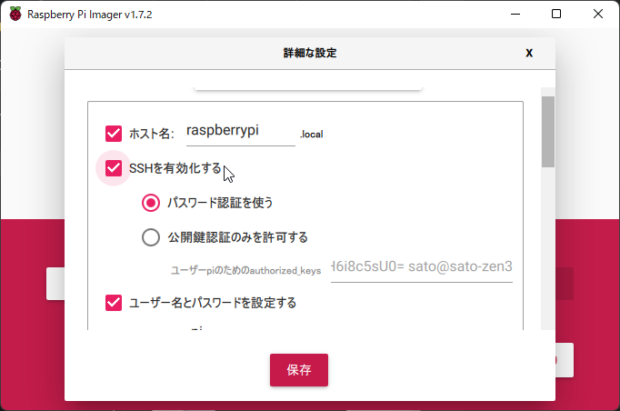

## SDカードの準備

最新の [SOLID for Raspberry Pi4用SDカードイメージ](http://solid.kmckk.com/rpi4/image_2022-07-05-SOLID-RPI4-raspios-bullseye-lite.img.xz) をダウンロードし、[Raspberry Pi Imager](https://www.raspberrypi.com/software/) で書き込みます。

####  カスタムイメージの選択

`Raspberry Pi Imager` を起動し、os の選択画面で「カスタムイメージを使う」を選択し、ダウンロードしたSDカードイメージ(`image_yyyy-mm-dd-SOLID-RPI4-raspios-bullseye-lite.img.xz`)を指定します。

 

#### 設定

ウィンドウ右下の設定ボタンをクリックし、「詳細な設定」 を開きます。
`ホスト名`、`SSHを有効化する` にチェックを入れて設定してください。

 

#### イメージの書き込み

「書き込む」ボタンをクリックしてイメージを書き込んでください。
